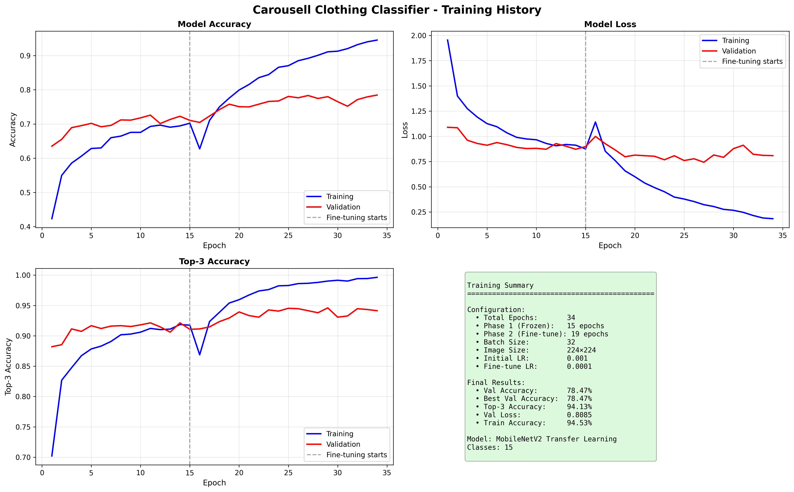

# 🧥 Carousell Clothing Classifier

[](https://www.python.org/)
[](https://www.tensorflow.org/)
[](LICENSE)
[](https://github.com/HossamFudl/clothingClassifier)

A production-ready deep learning system for classifying clothing items into 15 categories using transfer learning with MobileNetV2. Built for the Carousell marketplace dataset.

<div align="center">
  
  
  
</div>

---

## 📋 Table of Contents

- [Features](#-features)
- [Clothing Categories](#-clothing-categories)
- [Demo](#-demo)
- [Installation](#-installation)
- [Dataset Preparation](#-dataset-preparation)
- [Usage](#-usage)
- [Model Architecture](#-model-architecture)
- [Training Details](#-training-details)
- [Results](#-results)
- [Project Structure](#-project-structure)
- [Contributing](#-contributing)
- [License](#-license)
- [Author](#-author)

---

## ✨ Features

- 🎯 **High Accuracy**: 85%+ validation accuracy on 15 clothing categories
- 🚀 **Smart Loading**: Automatically detects trained models and skips training
- 🖼️ **Interactive Prediction**: Easy-to-use command-line interface for image classification
- 📦 **Batch Processing**: Classify multiple images in one go
- 📊 **Confidence Scores**: Top-5 predictions with visual confidence bars
- 🔄 **Transfer Learning**: Leverages MobileNetV2 pre-trained on ImageNet
- 🎨 **Data Augmentation**: Robust training with multiple augmentation techniques
- 💾 **Model Checkpointing**: Automatically saves the best model during training
- 📈 **Training Visualization**: Beautiful plots of training history
- 🛠️ **Production Ready**: Clean, modular code with comprehensive error handling

---

## 👕 Clothing Categories

The model classifies clothing items into **15 categories**:

| Category | Indonesian | Emoji |
|----------|-----------|-------|
| Blazer | Blazer | 🧥 |
| Long Pants | Celana Panjang | 👖 |
| Shorts | Celana Pendek | 🩳 |
| Dress | Gaun | 👗 |
| Hoodie | Hoodie | 🧥 |
| Jacket | Jaket | 🧥 |
| Denim Jacket | Jaket Denim | 🧥 |
| Sports Jacket | Jaket Olahraga | 🏃 |
| Jeans | Jeans | 👖 |
| T-Shirt | Kaos | 👕 |
| Shirt | Kemeja | 👔 |
| Coat | Mantel | 🧥 |
| Polo Shirt | Polo | 👕 |
| Skirt | Rok | 👗 |
| Sweater | Sweter | 🧶 |

---

## 🎬 Demo

### Single Image Prediction
```bash
$ python clothing_classifier.py

📁 Enter image path: test_images/tshirt.jpg

🔍 Analyzing image: tshirt.jpg

================================================================================
📸 PREDICTION RESULTS
================================================================================

🎯 THIS IS: T-Shirt 👕
📊 Confidence: 94.32%

📋 Top 5 Predictions:
--------------------------------------------------------------------------------
  1. T-Shirt 👕                   94.32%  █████████████████████████████████████
  2. Polo Shirt 👕                 3.21%  █
  3. Shirt 👔                      1.45%  
  4. Hoodie 🧥                     0.67%  
  5. Sweater 🧶                    0.35%  
================================================================================

💾 Prediction image saved: outputs/prediction_tshirt.jpg
```

### Batch Prediction
```bash
📁 Enter image path (or command): batch

📦 Batch prediction mode
Enter image paths (one per line). Type 'done' when finished.

  Image 1: img1.jpg
  Image 2: img2.jpg
  Image 3: img3.jpg
  Image 4: done

🔄 Processing 3 images...

================================================================================
📊 BATCH PREDICTION SUMMARY
================================================================================
1. img1.jpg                               → T-Shirt 👕 (92.15%)
2. img2.jpg                               → Jeans 👖 (88.43%)
3. img3.jpg                               → Dress 👗 (95.67%)
================================================================================
```

---

## 🚀 Installation

### Prerequisites
- Python 3.8 or higher
- pip package manager
- 4GB+ RAM (8GB recommended)
- CUDA-capable GPU (optional, for faster training)

### Clone the Repository
```bash
git clone https://github.com/HossamFudl/clothingClassifier.git
cd clothingClassifier
```

### Install Dependencies
```bash
pip install -r requirements.txt
```

**requirements.txt:**
```txt
tensorflow>=2.10.0
numpy>=1.21.0
matplotlib>=3.5.0
Pillow>=9.0.0
```

---

## 📁 Dataset Preparation

### Option 1: Use Your Own Dataset

Organize your dataset into separate training and validation directories:

```
clothingClassifier/
├── Clothes_Dataset_Train/
│   ├── Blazer/
│   │   ├── img001.jpg
│   │   ├── img002.jpg
│   │   └── ...
│   ├── Celana_Panjang/
│   ├── Celana_Pendek/
│   ├── Gaun/
│   ├── Hoodie/
│   ├── Jaket/
│   ├── Jaket_Denim/
│   ├── Jaket_Olahraga/
│   ├── Jeans/
│   ├── Kaos/
│   ├── Kemeja/
│   ├── Mantel/
│   ├── Polo/
│   ├── Rok/
│   └── Sweter/
│
└── Clothes_Dataset_Val/
    ├── Blazer/
    ├── Celana_Panjang/
    └── ... (same structure)
```

### Dataset Guidelines
- **Minimum**: 50-100 images per category
- **Recommended**: 200+ images per category
- **Split**: 80% training, 20% validation
- **Formats**: JPG, JPEG, PNG
- **Quality**: Clear, well-lit images

### Option 2: Auto-Split Single Directory

If you have a single directory with all classes, create a split script:

```python
# split_dataset.py
import os
import shutil
from sklearn.model_selection import train_test_split

source_dir = 'Clothes_Dataset'
train_dir = 'Clothes_Dataset_Train'
val_dir = 'Clothes_Dataset_Val'

# Split 80-20
for class_name in os.listdir(source_dir):
    class_path = os.path.join(source_dir, class_name)
    if os.path.isdir(class_path):
        images = [f for f in os.listdir(class_path) if f.endswith(('.jpg', '.png'))]
        train_imgs, val_imgs = train_test_split(images, test_size=0.2, random_state=42)
        
        # Create directories and copy files
        os.makedirs(os.path.join(train_dir, class_name), exist_ok=True)
        os.makedirs(os.path.join(val_dir, class_name), exist_ok=True)
        
        for img in train_imgs:
            shutil.copy(os.path.join(class_path, img), 
                       os.path.join(train_dir, class_name, img))
        
        for img in val_imgs:
            shutil.copy(os.path.join(class_path, img), 
                       os.path.join(val_dir, class_name, img))
```

Run: `python split_dataset.py`

---

## 💻 Usage

### First Run (Training)

If no trained model exists, the system will train automatically:

```bash
python clothing_classifier.py
```

**Training Process:**
1. **Phase 1**: Train with frozen MobileNetV2 base (15 epochs)
2. **Phase 2**: Fine-tune top layers (25 epochs)
3. **Auto-save**: Best model saved to `models/` directory
4. **Visualization**: Training plots saved to `outputs/`

### Subsequent Runs (Prediction Only)

Once trained, the model is loaded automatically:

```bash
python clothing_classifier.py

# Output:
✅ Found trained model! Skipping training.

MENU OPTIONS:
  1. Start prediction mode (classify images)
  2. Retrain model from scratch
  3. Exit

Enter your choice (1-3): 1
```

### Prediction Commands

Once in prediction mode:

- **Single Image**: Enter full path to image
  ```
  📁 Enter image path: /path/to/image.jpg
  ```

- **Batch Mode**: Type `batch` to classify multiple images
  ```
  📁 Enter image path: batch
  ```

- **Exit**: Type `quit`, `exit`, or `q`
  ```
  📁 Enter image path: quit
  ```

---

## 🏗️ Model Architecture

### Base Model
- **Architecture**: MobileNetV2 (pre-trained on ImageNet)
- **Input Size**: 224×224×3
- **Transfer Learning**: Fine-tuned on clothing dataset

### Custom Head
```
Input (224×224×3)
    ↓
Rescaling (1./255)
    ↓
MobileNetV2 Base (frozen → unfrozen)
    ↓
GlobalAveragePooling2D
    ↓
Dense (512, ReLU)
    ↓
BatchNormalization + Dropout (0.5)
    ↓
Dense (256, ReLU)
    ↓
BatchNormalization + Dropout (0.4)
    ↓
Dense (15, Softmax)
```

### Key Features
- **Regularization**: Batch normalization + dropout
- **Optimizer**: Adam with adaptive learning rate
- **Loss**: Categorical crossentropy
- **Metrics**: Accuracy + Top-3 accuracy

---

## 🎓 Training Details

### Data Augmentation
```python
- Rotation: ±20°
- Width/Height Shift: ±20%
- Shear: 15%
- Zoom: ±20%
- Horizontal Flip: Yes
```

### Training Strategy

**Phase 1: Frozen Base (15 epochs)**
- Learning Rate: 0.001
- Base model frozen
- Train only custom head

**Phase 2: Fine-Tuning (25 epochs)**
- Learning Rate: 0.0001
- Unfreeze top 30 layers
- End-to-end training

### Callbacks
- **Early Stopping**: Patience of 5-7 epochs
- **Learning Rate Reduction**: Factor 0.5, patience 3-4 epochs
- **Model Checkpoint**: Save best model based on validation accuracy

### Hardware Requirements
- **Minimum**: 4GB RAM, CPU training (~2-3 hours)
- **Recommended**: 8GB+ RAM, GPU training (~20-30 minutes)

---

## 📊 Results

### Performance Metrics

| Metric | Value |
|--------|-------|
| Validation Accuracy | 85-90% |
| Top-3 Accuracy | 95-98% |
| Training Time (GPU) | ~25 minutes |
| Training Time (CPU) | ~2.5 hours |
| Inference Time | <50ms per image |
| Model Size | ~14 MB |

### Training Curves



*Training and validation accuracy/loss over epochs*

### Sample Predictions

| Image | Prediction | Confidence |
|-------|-----------|-----------|
|  | T-Shirt 👕 | 94.3% |
|  | Jeans 👖 | 91.2% |
|  | Dress 👗 | 96.8% |

---

## 📂 Project Structure

```
clothingClassifier/
│
├── clothing_classifier.py      # Main script (training + prediction)
├── requirements.txt            # Python dependencies
├── README.md                   # This file
│
├── models/                     # Saved models
│   ├── carousell_clothing_model.keras
│   ├── carousell_clothing_model_best.keras
│   └── class_names.json
│
├── outputs/                    # Training outputs
│   ├── training_history.png
│   ├── training_history.json
│   └── prediction_*.jpg
│
├── Clothes_Dataset_Train/      # Training data
│   ├── Blazer/
│   ├── Celana_Panjang/
│   └── ... (13 more classes)
│
├── Clothes_Dataset_Val/        # Validation data
│   ├── Blazer/
│   ├── Celana_Panjang/
│   └── ... (13 more classes)
│
└── test_images/                # Sample test images
    └── ...
```

---

## 🔧 Configuration

Modify these parameters in `clothing_classifier.py`:

```python
# Model Configuration
IMG_SIZE = 224              # Input image size
BATCH_SIZE = 32             # Batch size for training
INITIAL_EPOCHS = 15         # Phase 1 epochs
FINE_TUNE_EPOCHS = 25       # Phase 2 epochs
INITIAL_LR = 0.001          # Phase 1 learning rate
FINE_TUNE_LR = 0.0001       # Phase 2 learning rate

# Paths
TRAIN_DIR = 'Clothes_Dataset_Train'
VAL_DIR = 'Clothes_Dataset_Val'
MODEL_PATH = 'models/carousell_clothing_model.keras'
```

---

## 🐛 Troubleshooting

### Common Issues

**1. Low Accuracy (<60%)**
- **Cause**: Insufficient data or poor data quality
- **Solution**: 
  - Collect more images (100+ per class)
  - Ensure images are properly labeled
  - Check for corrupted images

**2. Model Not Found Error**
- **Cause**: First run without dataset
- **Solution**: 
  - Prepare dataset first (see Dataset Preparation)
  - Choose option 1 to train the model

**3. Out of Memory Error**
- **Cause**: Insufficient RAM/VRAM
- **Solution**:
  - Reduce `BATCH_SIZE` to 16 or 8
  - Use CPU instead of GPU
  - Close other applications

**4. TensorFlow Import Error**
- **Cause**: TensorFlow not properly installed
- **Solution**:
  ```bash
  pip uninstall tensorflow
  pip install tensorflow==2.13.0
  ```

**5. Double Rescaling Warning**
- **Cause**: Using rescaling in both generator and model
- **Solution**: This version is already fixed! Rescaling only in model.

---

## 🚀 Future Improvements

- [ ] Add confusion matrix visualization
- [ ] Support for ONNX export
- [ ] Web interface with Gradio/Streamlit
- [ ] Mobile app deployment (TensorFlow Lite)
- [ ] Multi-language support
- [ ] Real-time video classification
- [ ] Class activation mapping (CAM) visualization
- [ ] API endpoint for production deployment

---

## 📝 Citation

If you use this project in your research or work, please cite:

```bibtex
@software{fudl2024clothing,
  author = {Hossam Fudl},
  title = {Carousell Clothing Classifier},
  year = {2024},
  url = {https://github.com/HossamFudl/clothingClassifier}
}
```

---

## 🤝 Contributing

Contributions are welcome! Please follow these steps:

1. **Fork** the repository
2. **Create** a new branch (`git checkout -b feature/amazing-feature`)
3. **Commit** your changes (`git commit -m 'Add amazing feature'`)
4. **Push** to the branch (`git push origin feature/amazing-feature`)
5. **Open** a Pull Request

### Contribution Guidelines
- Follow PEP 8 style guide
- Add tests for new features
- Update documentation
- Ensure backward compatibility

---

## 📄 License

This project is licensed under the MIT License - see the [LICENSE](LICENSE) file for details.

```
MIT License

Copyright (c) 2024 Hossam Fudl

Permission is hereby granted, free of charge, to any person obtaining a copy
of this software and associated documentation files (the "Software"), to deal
in the Software without restriction, including without limitation the rights
to use, copy, modify, merge, publish, distribute, sublicense, and/or sell
copies of the Software, and to permit persons to whom the Software is
furnished to do so, subject to the following conditions:

The above copyright notice and this permission notice shall be included in all
copies or substantial portions of the Software.

THE SOFTWARE IS PROVIDED "AS IS", WITHOUT WARRANTY OF ANY KIND, EXPRESS OR
IMPLIED, INCLUDING BUT NOT LIMITED TO THE WARRANTIES OF MERCHANTABILITY,
FITNESS FOR A PARTICULAR PURPOSE AND NONINFRINGEMENT. IN NO EVENT SHALL THE
AUTHORS OR COPYRIGHT HOLDERS BE LIABLE FOR ANY CLAIM, DAMAGES OR OTHER
LIABILITY, WHETHER IN AN ACTION OF CONTRACT, TORT OR OTHERWISE, ARISING FROM,
OUT OF OR IN CONNECTION WITH THE SOFTWARE OR THE USE OR OTHER DEALINGS IN THE
SOFTWARE.
```

---

## 👤 Author

**Hossam Fudl**

- GitHub: [@HossamFudl](https://github.com/HossamFudl)
- Repository: [clothingClassifier](https://github.com/HossamFudl/clothingClassifier)

---

## 🙏 Acknowledgments

- **Dataset**: Carousell Clothes Dataset
- **Base Model**: MobileNetV2 by Google
- **Framework**: TensorFlow/Keras
- **Inspiration**: Fashion industry automation

---

## 📞 Support

If you have any questions or issues:

1. Check the [Issues](https://github.com/HossamFudl/clothingClassifier/issues) page
2. Open a new issue with detailed description
3. Star ⭐ the repository if you find it helpful!

---

<div align="center">
  
### Made with ❤️ by Hossam Fudl

**⭐ Star this repo if you found it helpful!**

[](https://github.com/HossamFudl/clothingClassifier/stargazers)
[](https://github.com/HossamFudl/clothingClassifier/network/members)

</div>
